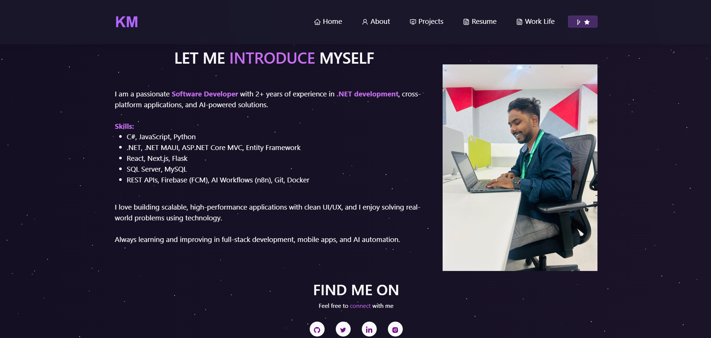

<h2 align="center">
  Kuldeep Jagdeo Mhaske - Portfolio Website<br/>
  <a href="https://kuldeepmhaske.github.io/Portfolio/" target="_blank">View Website</a>
</h2>
<div align="center">
  
</div>

<br/>

<center>

[](https://forthebadge.com) &nbsp;
[](https://forthebadge.com) &nbsp;
[](https://forthebadge.com) &nbsp;
 &nbsp;


</center>

<h3 align="center">
    🔹
    <a href="https://github.com/kuldeepmhaske/Portfolio/issues">Report Bug</a> &nbsp; &nbsp;
    🔹
    <a href="https://github.com/kuldeepmhaske/Portfolio/issues">Request Feature</a>
</h3>

## About Me

**Kuldeep Jagdeo Mhaske**  
Software Developer | .NET & Cross-Platform App Developer  
2+ Years in .NET development  
India

I am a passionate Software Developer specializing in .NET, cross-platform applications, and AI-powered solutions. I have hands-on experience building real-world applications with a focus on scalability, performance, and clean UI/UX. I love solving problems with technology and continuously improving my skills in full-stack development, mobile apps, and AI automation.

## Built With

This portfolio features my projects, resume, and technical skills.

- React.js
- .NET, .NET MAUI, ASP.NET Core MVC
- Entity Framework
- JavaScript, Python, Flask
- SQL Server, MySQL
- React-Bootstrap
- Vercel

## Features

**📖 Multi-Page Layout**  
**🎨 Styled with React-Bootstrap and CSS, easy to customize colors**  
**📱 Fully Responsive**  
**🛠 SEO Optimized**

## Getting Started

Clone this repository. You will need `node.js` and `git` installed globally on your machine.

## 🛠 Installation and Setup Instructions

1. Install dependencies:  
   ```
   npm install
   ```

2. Start the development server:  
   ```
   npm start
   ```

Open [http://localhost:3000](http://localhost:3000) to view it in your browser.

## Usage Instructions

- Edit your information in `/src/components/`.
- Add your profile photo to `/src/assets/profile.jpg`.
- Update project images in `/src/Assets/`.

## Show your support

Give a ⭐ if you like this website!

---

**Contact:**  
- Email: kuldeepmhaske.dev@gmail.com  
- LinkedIn: [linkedin.com/in/kuldeepmhaske](https://linkedin.com/in/kuldeepmhaske)  
- GitHub: [github.com/kuldeepmhaske](https://github.com/kuldeepmhaske)
